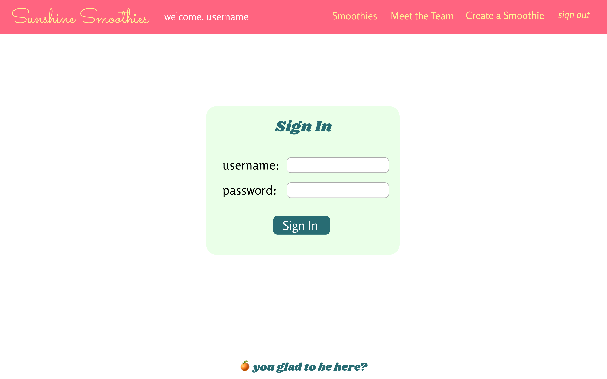
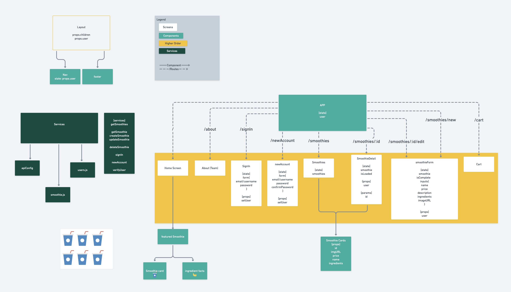

# Project-3
An awesome E-commerce app

## Owlbear Cubs
Clint Gunter
Lance Walker
Julia Dwyer
Jeff Bailey
Terra Claycamp

## Project Description
Sunshine Smoothies is an e-commerce application that lets users shop for smoothies, create their own smoothie, and edit smoothies. Smoothies are stored in a database. Users can see the smoothies they create as well as the smoothies created by others. The store also has a default selection of smoothies. If a user is signed in they’ll have the ability to create or edit smoothies.

## WireFrames





## Component Hierarchy



## Schema
  ```
  const Smoothie = new Schema(
    {
      title: { type: String, required: true },
      price: { type: String, required: true },
      description: { type: String, required: true },
      ingredients: { type: String, required: true },
      imageURL: { type: String, required: true },
  }
  )

  const User = new Schema(
    {
      name: {type: String, required: true },
      email: {type: String, required: true },
      password_digest: {type: String, required: true, select: false }
    }
  )
  ```
## MVP/PMVP

### MVP
* User is able to sign up and sign in
* App uses password protected authentication using JSON tokens
* When signed in, user is able to create and edit smoothies (full CRUD)
* A page that displays all smoothies in a grid
* Both logged in and not logged in users can click each smoothie to view Smoothie Detail Page
* A search bar that allows users to filter displayed smoothies

### PMVP
* User can add smoothies to their cart
* Improved styling on Home page banners
* Smoothie Quiz for users to find the right smoothie for them
* User can only edit and delete a smoothie that they have created (using association)

## Project Schedule
|Day| Deliverables | Status |
|Monday| Build out Back End, |Incomplete |
|Tuesday| Code, Build out FrontEnd , Assign files to each teammate|Incomplete |
|Wednesday| Code out front end files Independently|Incomplete |
|Thursday| Code out independently with timed checkins, MVP |Incomplete |
|Friday| Work on PMVP|Incomplete |
